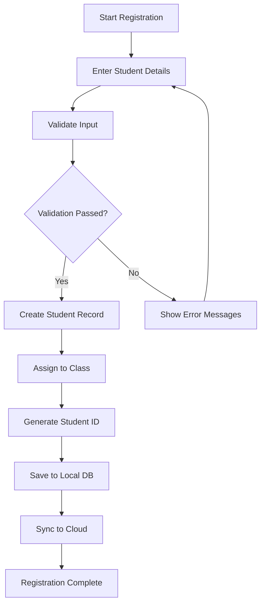
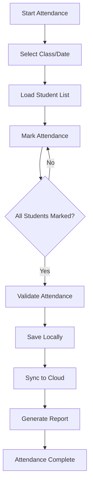
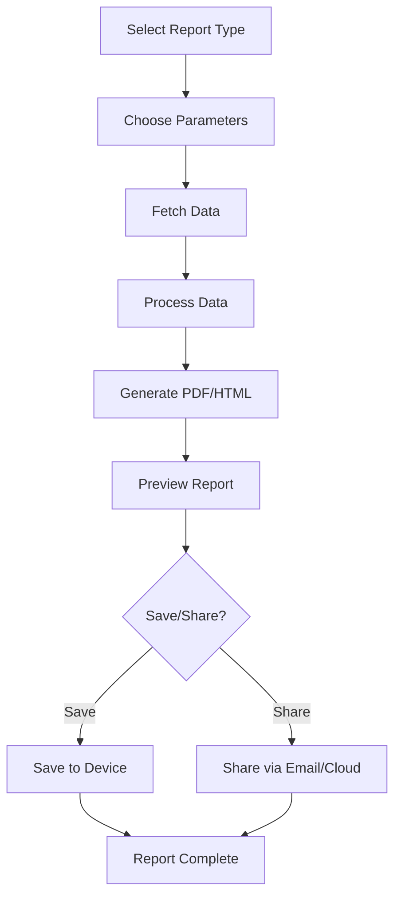

# Smart School Assistant - Complete Project Documentation

## 📋 Table of Contents
1. [Project Overview](#project-overview)
2. [Architecture & Design](#architecture--design)
3. [User Journey Flow](#user-journey-flow)
4. [Technical Implementation](#technical-implementation)
5. [Setup & Installation](#setup--installation)
6. [Key Workflows](#key-workflows)
7. [Database Schema](#database-schema)
8. [API Integration](#api-integration)
9. [Security Features](#security-features)
10. [Deployment Guide](#deployment-guide)

---

## 🎯 Project Overview

The **Smart School Assistant** is a comprehensive Flutter-based school management system designed to streamline educational administration, student management, and academic processes. Built with modern technologies and best practices, it provides a complete solution for schools ranging from small institutions to large educational complexes.

### Key Features
- **Multi-role Authentication**: Admin, Principal, Teacher, Staff, Parent, Student roles
- **Student Management**: Registration, enrollment, attendance tracking
- **Academic Management**: Class assignments, timetable management, assessments
- **Reporting System**: Advanced reports, analytics dashboard, PDF generation
- **Offline Support**: Local data storage with Firebase synchronization
- **Security**: MFA, biometric authentication, encrypted data storage
- **Cross-platform**: Android, iOS, Web, Windows support

---

## 🏗️ Architecture & Design

### System Architecture

```
┌─────────────────┐    ┌─────────────────┐    ┌─────────────────┐
│   Presentation  │    │   Business      │    │   Data          │
│   Layer         │◄──►│   Logic Layer   │◄──►│   Layer         │
│   (Screens/UI)  │    │   (Services)    │    │   (Firebase +   │
│                 │    │                 │    │    Local DB)    │
└─────────────────┘    └─────────────────┘    └─────────────────┘
         │                       │                       │
         ▼                       ▼                       ▼
┌─────────────────┐    ┌─────────────────┐    ┌─────────────────┐
│   Widgets       │    │   Models        │    │   Hive Boxes    │
│   Components    │    │   (Data Classes)│    │   Collections   │
└─────────────────┘    └─────────────────┘    └─────────────────┘
```

### Technology Stack

#### Frontend (Flutter)
- **Framework**: Flutter 3.x
- **Language**: Dart
- **State Management**: Provider + ChangeNotifier
- **UI Components**: Material Design 3
- **Local Storage**: Hive
- **Dependency Injection**: GetIt (planned)

#### Backend (Firebase)
- **Authentication**: Firebase Auth
- **Database**: Cloud Firestore
- **Storage**: Firebase Storage
- **Functions**: Firebase Cloud Functions
- **Hosting**: Firebase Hosting

#### Additional Services
- **Connectivity**: Connectivity Plus
- **Biometric Auth**: Local Auth
- **PDF Generation**: Advanced PDF Service
- **Encryption**: Pointycastle + Crypto
- **Notifications**: Firebase Cloud Messaging

---

## 🚀 User Journey Flow

### Phase 1: Initial Setup (Beginner Level)

#### Step 1: First Launch & Admin Setup
```
App Launch → Check Admin Setup → Admin Setup Screen
    ↓
Enter School Info → Create Admin Account → Setup Complete
    ↓
Navigate to Home Screen
```

**Technical Flow:**
1. `main.dart` initializes the app
2. `AppState` checks `adminSetupComplete` flag in Hive
3. If false, redirect to `AdminSetupScreen`
4. Admin enters school details and credentials
5. `LocalAuthService.registerLocalUser()` creates local account
6. `FirebaseService` creates cloud account
7. `Hive` stores admin data locally
8. `Firestore` syncs data to cloud

#### Step 2: Basic Configuration
```
Home Screen → Settings → Basic Configuration
    ↓
School Settings → User Roles → Initial Data Setup
```

### Phase 2: User Onboarding (Intermediate Level)

#### Step 3: User Registration & Authentication
```
Login Screen → Authentication Flow
    ↓
Email/Password → MFA Verification → Role Assignment
    ↓
Dashboard Access
```

**Authentication Flow:**
```
1. Email/Password Input
2. Firebase Auth Sign-in
3. MFA Check (if enabled)
4. User Profile Loading
5. Role-based Access Control
6. Dashboard Navigation
```

#### Step 4: Role-Based Access Setup
```
Admin → Create Users → Assign Roles → Set Permissions
    ↓
Teachers → Subject Assignment → Class Management
    ↓
Students → Enrollment → Parent Linking
```

### Phase 3: Core Operations (Advanced Level)

#### Step 5: Daily Operations
```
Dashboard → Module Selection → Data Entry/Update
    ↓
Real-time Sync → Local Storage → Cloud Backup
```

#### Step 6: Reporting & Analytics
```
Reports Hub → Generate Reports → Export/Share
    ↓
Analytics Dashboard → Insights → Decision Making
```

### Phase 4: Advanced Features (Expert Level)

#### Step 7: System Administration
```
Admin Panel → System Settings → Backup/Restore
    ↓
User Management → Security Settings → Audit Logs
```

#### Step 8: Integration & Extensions
```
API Integration → Third-party Services → Custom Modules
    ↓
Advanced Analytics → AI Features → Mobile Apps
```

---

## 💻 Technical Implementation

### Core Components

#### 1. Authentication System
```dart
// Main Auth Flow
class ComprehensiveAuthService {
  Future<AuthResult> signInWithEmailAndPassword(email, password) async {
    // 1. Validate credentials
    // 2. Check offline/online mode
    // 3. Firebase authentication
    // 4. MFA verification
    // 5. User profile loading
    // 6. Session management
  }
}
```

#### 2. Data Management
```dart
// Local + Cloud Sync
class UserSyncService {
  Future<SyncResult> performFullSync() async {
    // 1. Check connectivity
    // 2. Load local changes
    // 3. Sync with Firebase
    // 4. Resolve conflicts
    // 5. Update metadata
  }
}
```

#### 3. UI Architecture
```dart
// Screen Structure
class BaseScreen extends StatefulWidget {
  @override
  Widget build(BuildContext context) {
    return Scaffold(
      appBar: AppBar(title: Text('Screen Title')),
      body: Column(
        children: [
          _buildHeader(),
          Expanded(child: _buildContent()),
          _buildFooter(),
        ],
      ),
    );
  }
}
```

### Key Services Architecture

#### Authentication Service Layer
```
ComprehensiveAuthService (Main Orchestrator)
├── FirebaseService (Cloud Auth)
├── LocalAuthService (Offline Auth)
├── MFAService (Multi-factor Auth)
├── SocialAuthService (Social Login)
└── SessionManager (Session Handling)
```

#### Data Service Layer
```
Data Management Services
├── UserSyncService (User Data Sync)
├── BackupService (Data Backup)
├── EncryptionService (Data Security)
└── FirebaseService (Cloud Operations)
```

#### UI Service Layer
```
UI Support Services
├── ThemeService (App Theming)
├── NavigationService (Route Management)
├── NotificationService (User Notifications)
└── ValidationService (Input Validation)
```

---

## ⚙️ Setup & Installation

### Prerequisites
- Flutter SDK 3.0+
- Dart SDK 3.0+
- Android Studio / VS Code
- Firebase Project
- Git

### Installation Steps

#### 1. Clone Repository
```bash
git clone https://github.com/your-repo/smart-school-assistant.git
cd smart-school-assistant
```

#### 2. Install Dependencies
```bash
flutter pub get
```

#### 3. Firebase Setup
```bash
# Copy Firebase config files
cp android/app/google-services.json.example android/app/google-services.json
cp web/firebase-config.js.example web/firebase-config.js
cp ios/Runner/GoogleService-Info.plist.example ios/Runner/GoogleService-Info.plist
```

#### 4. Configure Firebase
1. Create Firebase project
2. Enable Authentication, Firestore, Storage
3. Configure security rules
4. Update configuration files

#### 5. Run App
```bash
# Development
flutter run

# Production build
flutter build apk
flutter build ios
```

### Environment Configuration

#### Development Environment
```dart
const String environment = 'development';
const String apiBaseUrl = 'https://dev-api.example.com';
const bool enableLogging = true;
```

#### Production Environment
```dart
const String environment = 'production';
const String apiBaseUrl = 'https://api.example.com';
const bool enableLogging = false;
```

---

## 🔄 Key Workflows

### 1. Student Registration Workflow



### 2. Attendance Tracking Workflow



### 3. Report Generation Workflow



---

## 🗄️ Database Schema

### Local Database (Hive)

#### Users Collection
```dart
class User {
  String id;
  String email;
  String displayName;
  String role; // admin, teacher, student, parent
  String? photoUrl;
  DateTime createdAt;
  DateTime? lastLoginAt;
  bool isActive;
  String? schoolName;
}
```

#### Students Collection
```dart
class Student {
  String id;
  String fullName;
  String? studentId;
  String? grade;
  int? age;
  String classSectionId;
  DateTime dateOfBirth;
  String? parentContact;
  Map<String, dynamic> additionalInfo;
}
```

#### Classes Collection
```dart
class ClassSection {
  String id;
  String name;
  String grade;
  String? teacherId;
  int capacity;
  List<String> subjectIds;
  Map<String, dynamic> schedule;
}
```

### Cloud Database (Firestore)

#### Collections Structure
```
/users/{userId}
  ├── profile: User
  ├── preferences: Map
  └── settings: Map

/students/{studentId}
  ├── profile: Student
  ├── attendance: Collection
  ├── grades: Collection
  └── activities: Collection

/classes/{classId}
  ├── info: ClassSection
  ├── students: Collection
  ├── timetable: Collection
  └── assignments: Collection

/reports/{reportId}
  ├── metadata: ReportInfo
  ├── data: Map
  └── generated: Timestamp
```

---

## 🔗 API Integration

### Firebase Integration

#### Authentication APIs
```dart
// Firebase Auth Integration
class FirebaseService {
  static Future<UserCredential> signInWithEmailAndPassword(
    String email,
    String password,
  ) async {
    return await _auth.signInWithEmailAndPassword(
      email: email,
      password: password,
    );
  }
}
```

#### Firestore Operations
```dart
// Data Synchronization
class FirebaseService {
  static Future<void> saveUserToFirestore(User user) async {
    await _firestore.collection('users').doc(user.id).set({
      'email': user.email,
      'displayName': user.displayName,
      'role': user.role,
      'createdAt': Timestamp.fromDate(user.createdAt),
      'isActive': user.isActive,
    });
  }
}
```

### Third-party Integrations

#### PDF Generation
```dart
class AdvancedPdfService {
  Future<File> generateStudentReport(Student student) async {
    final pdf = pw.Document();

    pdf.addPage(pw.Page(
      build: (pw.Context context) {
        return pw.Column(
          children: [
            pw.Text('Student Report'),
            pw.Text('Name: ${student.fullName}'),
            // Add more content
          ],
        );
      },
    ));

    return await _savePdf(pdf, 'student_report.pdf');
  }
}
```

#### Social Authentication
```dart
class SocialAuthService {
  static Future<SocialAuthResult> signInWithGoogle() async {
    final GoogleSignInAccount? googleUser = await _googleSignIn.signIn();
    final GoogleSignInAuthentication googleAuth = await googleUser!.authentication;

    final credential = GoogleAuthProvider.credential(
      accessToken: googleAuth.accessToken,
      idToken: googleAuth.idToken,
    );

    return await FirebaseAuth.instance.signInWithCredential(credential);
  }
}
```

---

## 🔒 Security Features

### Authentication Security
- **Multi-factor Authentication (MFA)**: TOTP, SMS, Email verification
- **Biometric Authentication**: Fingerprint, Face ID support
- **Session Management**: Automatic logout, session timeout
- **Password Policies**: Complexity requirements, expiration

### Data Security
- **Encryption**: AES-256 encryption for sensitive data
- **Local Storage**: Encrypted Hive boxes
- **Cloud Security**: Firebase security rules
- **API Security**: JWT tokens, request signing

### Code Security
```dart
// Secure Data Handling
class EncryptionService {
  static String encryptData(String data) {
    final key = encrypt.Key.fromSecureRandom(32);
    final iv = encrypt.IV.fromSecureRandom(16);
    final encrypter = encrypt.Encrypter(encrypt.AES(key));

    final encrypted = encrypter.encrypt(data, iv: iv);
    return '${iv.base64}:${encrypted.base64}';
  }
}
```

---

## 🚀 Deployment Guide

### Android Deployment

#### 1. Build APK
```bash
flutter build apk --release
```

#### 2. Build App Bundle
```bash
flutter build appbundle --release
```

#### 3. Sign APK (if needed)
```bash
jarsigner -verbose -sigalg SHA1withRSA -digestalg SHA1 \
  -keystore keystore.jks app-release-unsigned.apk alias_name
```

### iOS Deployment

#### 1. Build for iOS
```bash
flutter build ios --release
```

#### 2. Archive in Xcode
```bash
open ios/Runner.xcworkspace
# Archive → Distribute App → App Store Connect
```

### Web Deployment

#### 1. Build for Web
```bash
flutter build web --release
```

#### 2. Deploy to Firebase Hosting
```bash
firebase init hosting
firebase deploy
```

### Windows Deployment

#### 1. Build for Windows
```bash
flutter build windows --release
```

#### 2. Package as MSI
```bash
# Use tools like Inno Setup or Advanced Installer
```

### CI/CD Pipeline

#### GitHub Actions Example
```yaml
name: Flutter CI/CD

on:
  push:
    branches: [ main, develop ]
  pull_request:
    branches: [ main ]

jobs:
  test:
    runs-on: ubuntu-latest
    steps:
      - uses: actions/checkout@v2
      - uses: subosito/flutter-action@v2
        with:
          flutter-version: '3.0.0'
      - run: flutter pub get
      - run: flutter analyze
      - run: flutter test

  build-android:
    runs-on: ubuntu-latest
    if: github.ref == 'refs/heads/main'
    steps:
      - uses: actions/checkout@v2
      - uses: subosito/flutter-action@v2
        with:
          flutter-version: '3.0.0'
      - run: flutter build apk --release
      - uses: actions/upload-artifact@v2
        with:
          name: apk-release
          path: build/app/outputs/flutter-apk/app-release.apk
```

---

## 📊 Monitoring & Analytics

### Performance Monitoring
- **Firebase Performance Monitoring**: Track app performance
- **Crashlytics**: Error reporting and crash analysis
- **Analytics**: User behavior tracking

### Logging System
```dart
class AuthEventLogger {
  static Future<void> logEvent(
    AuthEventType type,
    String message, {
    String? userId,
    AuthEventSeverity severity = AuthEventSeverity.info,
  }) async {
    final event = AuthEvent(
      type: type,
      message: message,
      timestamp: DateTime.now(),
      userId: userId,
      severity: severity,
    );

    // Log locally
    await _storeEventLocally(event);

    // Log to Firebase (if online)
    if (await _isOnline()) {
      await _logToFirebase(event);
    }
  }
}
```

---

## 🔧 Maintenance & Updates

### Regular Maintenance Tasks
1. **Dependency Updates**: Monthly Flutter and package updates
2. **Security Patches**: Regular security updates
3. **Database Optimization**: Periodic data cleanup
4. **Performance Monitoring**: Regular performance audits

### Backup Strategy
```dart
class BackupService {
  static Future<void> createFullBackup() async {
    // 1. Export all local data
    // 2. Compress data
    // 3. Encrypt backup
    // 4. Upload to cloud storage
    // 5. Verify backup integrity
  }
}
```

---

## 📞 Support & Troubleshooting

### Common Issues

#### 1. Authentication Issues
- **Problem**: Login fails
- **Solution**: Check Firebase configuration, network connectivity
- **Debug**: Enable verbose logging in `AuthService`

#### 2. Sync Issues
- **Problem**: Data not syncing
- **Solution**: Check internet connection, Firebase permissions
- **Debug**: Monitor `UserSyncService` logs

#### 3. Performance Issues
- **Problem**: App running slow
- **Solution**: Clear cache, optimize queries, update dependencies
- **Debug**: Use Flutter DevTools for profiling

### Support Channels
- **Documentation**: This comprehensive guide
- **Issue Tracker**: GitHub Issues
- **Community**: Discord/Forum support
- **Professional**: Premium support packages

---

## 🎯 Future Roadmap

### Phase 1 (Q1 2024): Core Enhancement
- [ ] Advanced analytics dashboard
- [ ] Mobile app for parents
- [ ] Integration with learning management systems
- [ ] Enhanced reporting features

### Phase 2 (Q2 2024): AI Integration
- [ ] AI-powered insights
- [ ] Automated grading assistance
- [ ] Smart attendance prediction
- [ ] Personalized learning recommendations

### Phase 3 (Q3 2024): Enterprise Features
- [ ] Multi-school management
- [ ] Advanced user permissions
- [ ] API for third-party integrations
- [ ] White-label solutions

### Phase 4 (Q4 2024): Global Expansion
- [ ] Multi-language support
- [ ] International compliance
- [ ] Global cloud infrastructure
- [ ] Advanced security features

---

## 📝 Conclusion

The Smart School Assistant represents a comprehensive solution for modern educational institutions. Built with scalability, security, and user experience in mind, it provides a solid foundation for schools to digitize their operations and enhance educational outcomes.

### Key Success Factors
1. **User-Centric Design**: Intuitive interface for all user types
2. **Robust Architecture**: Scalable and maintainable codebase
3. **Security First**: Comprehensive security measures
4. **Offline Capability**: Reliable offline functionality
5. **Extensible Platform**: Easy to add new features

### Getting Started
1. Follow the setup guide in this documentation
2. Start with basic features and gradually adopt advanced ones
3. Regularly backup data and update the system
4. Engage with the community for support and updates

For more detailed information about specific components, refer to the inline code documentation and API references throughout the codebase.

---

*Last Updated: September 2024*
*Version: 2.0.0*
*Author: Smart School Assistant Development Team*